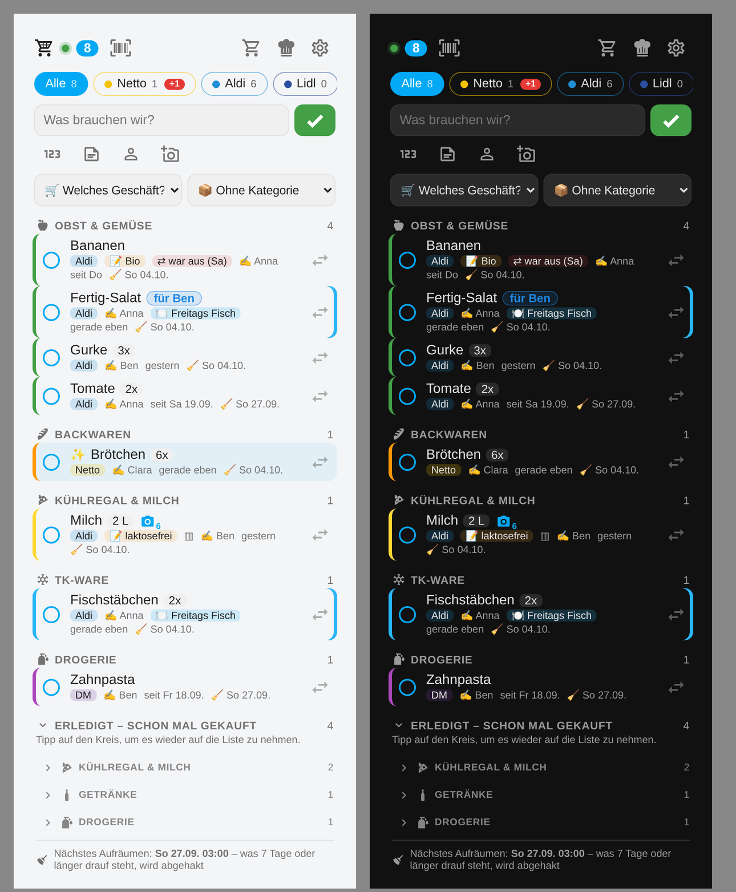

# 🛒 Einkaufsliste für Home Assistant

**Die Familien-Einkaufsliste direkt im Dashboard.** Du bekommst mehrere Geschäfte, Kategorien, Rezepte und Live-Sync auf allen Handys. Hinter jedem Artikel steht, wer ihn eingetragen hat. Was gekauft ist, wird abgehakt und bleibt als „schon mal gekauft“ in der Liste. So ist es beim nächsten Mal mit einem Tipp wieder drauf.



---

## ✨ Was kann das Ding?

| Funktion | So klappt's |
|---|---|
| 🏪 **Mehrere Geschäfte** | Netto, Aldi, Lidl, Rewe und DM sind vorbereitet, weitere legst du einfach in der Karte an. Oben hat jedes Geschäft seinen eigenen Reiter. |
| 🗂️ **Kategorien** | Obst & Gemüse, Backwaren, TK-Ware und so weiter. Offene **und** erledigte Artikel werden danach sortiert. |
| 👨‍👩‍👧‍👦 **Für die ganze Familie** | Jeder, der sich in Home Assistant anmelden kann, kann mitmachen. |
| ⭕ **Abhaken per Kreis** | Nur ein Tipp auf den Kreis hakt ab. Ein Tipp auf den Namen macht nichts, das verhindert Verdrücker. |
| ♻️ **Nichts geht verloren** | Abgehakte Artikel bleiben unten unter „Erledigt – schon mal gekauft“. Tippst du den Kreis nochmal an, steht der Artikel wieder auf der Liste. Die Kategorien sind dort eingeklappt, ein Tipp klappt sie auf. |
| 🏷️ **Für wen & wer** | Hinter dem Artikel steht, **für wen** er ist, zum Beispiel *Käse (für Oma)*. Klein darunter steht, **wer** ihn eingetragen oder wieder auf die Liste genommen hat: *✍️ Anna*. |
| 📝 **Notiz & 👤 Für wen** | Beides kannst du direkt beim Eintragen angeben, zum Beispiel *Käse · 📝 Gerieben · 👤 für Oma*. Die Notiz beginnt automatisch mit einem Großbuchstaben. |
| 🚫 **Keine Doppelten** | Jeder Artikel steht nur einmal auf der Liste. Ein zweites Mal geht nur mit **anderer Notiz**, **anderem „für wen“** oder **anderem Geschäft** (z. B. Milch bei Aldi und Milch bei Netto). |
| 🍽️ **Rezepte** | Leg ein Rezept an, zum Beispiel „Freitags Fisch“ mit allen Zutaten. Ein Tipp auf **Auf die Liste**, dann hakst du an, **welche Zutaten** du brauchst. |
| 🧹 **Automatisch aufräumen** | An einem festen Tag wird alles **abgehakt**, was mindestens 7 Tage drinsteht. **Gelöscht wird nichts.** |
| ⚡ **Live-Sync** | Trägt jemand etwas ein, steht es sofort auf allen Handys. Ohne Neuladen. |
| 📸 **Fotos** | Ein Foto zum Artikel („genau diese Marke!“), auswählbar direkt beim Eintragen. |
| 🔍 **Barcode** | In der Home-Assistant-App scannen: zu Hause zum **Eintragen** (auch mehrere hintereinander), im Laden zum **Abhaken**. |
| 📖 **Kategorie raten** | Tippst du „Joghurt“, springt die Kategorie von selbst auf Kühlregal, bei „Pizza“ auf TK-Ware. Dafür gibt es ein eingebautes Wörterbuch mit rund 250 Produkten. Wählst du selbst etwas aus, hat das Vorrang. |
| 🔁 **„War aus!“** | Gab's bei Aldi nicht? Tipp am Artikel auf **⇄** und dann auf **Netto**. Bei Aldi wird er abgehakt, bei Netto steht er offen. Beide Geschäfte behalten ihn unten bei „Erledigt“. |
| 📍 **Nächstes Geschäft** | Bist du bei einem Geschäft, springt die Liste automatisch auf dessen Reiter. Jeder sieht dabei sein eigenes Geschäft. |
| 🛒 **Laden-Modus** | Ein Tipp auf den Wagen oben: große Zeilen, dicke Kreise, das Eingabefeld ist weg. Nur noch abhaken, auch mit einer Hand am Einkaufswagen. |
| 🔗 **Doppelt-Finder** | Stehen „Tomate“ und „Tomaten“ (oder „Klopapier“ und „Toilettenpapier“) gleichzeitig drauf, fragt die Liste: **Zusammenlegen?** |
| ✨ **Ordentliche Namen** | Aus „  milch “ wird automatisch „Milch“. |
| 🔎 **Merkt sich Produkte** | Beim Tippen kommen Vorschläge, Geschäft und Kategorie werden automatisch ausgefüllt. Tippst du einen Vorschlag an, kommen auch Menge, Notiz und „für wen“ mit. |

---

## 🧹 Das Aufräumen, einfach erklärt

Stell dir vor, der Aufräum-Tag ist **Sonntag** und das Mindestalter ist **7 Tage**.

| Eingetragen am | 1. Sonntag danach | 2. Sonntag danach |
|---|---|---|
| **Dienstag** | erst 5 Tage alt, **bleibt offen** | 12 Tage alt, **wird abgehakt** |
| **Samstag** | erst 1 Tag alt, **bleibt offen** | 8 Tage alt, **wird abgehakt** |
| **Sonntag** (nach dem Aufräumen) | genau 7 Tage alt, **wird abgehakt** | – |

Jeder Artikel bleibt also **mindestens eine Woche** offen. Unter jedem Artikel zeigt die Karte mit 🧹 an, **an welchem Tag** er automatisch abgehakt wird. Danach steht er unter „Erledigt“ und du kannst ihn jederzeit mit einem Tipp zurückholen.

> 💡 Nimmst du einen Artikel wieder auf die Liste, fängt die Woche von vorne an.
> 💡 Hat Home Assistant zur Aufräumzeit geschlafen (Neustart, Update), wird das Aufräumen beim nächsten Start nachgeholt.
> 🗑️ Richtig löschen kannst du einen Artikel nur von Hand: **⚙️ Zahnrad → Produkte → Artikel löschen**. Dort gibt es auch ein Suchfeld.

Tag, Uhrzeit und Mindestalter stellst du hier ein:
**Einstellungen → Geräte & Dienste → Einkaufsliste → Konfigurieren**

---

## 📦 Installation (Schritt für Schritt)

### Schritt 1: In HACS hinzufügen
1. **HACS** öffnen.
2. Oben rechts auf die **drei Punkte ⋮** und dann auf **Benutzerdefinierte Repositories** tippen.
3. Bei Repository `https://github.com/misterm2310/einkaufslisten-card` eintragen, als Typ **Integration** wählen und **Hinzufügen** tippen.
4. Nach **Einkaufsliste** suchen, auf **Herunterladen** tippen und danach **Home Assistant neu starten**.

<details>
<summary>Ohne HACS (von Hand)</summary>

Kopiere den Ordner `custom_components/einkaufsliste` nach `/config/custom_components/einkaufsliste` und starte Home Assistant neu.
</details>

### Schritt 2: Integration einrichten
1. **Einstellungen → Geräte & Dienste → Integration hinzufügen**
2. Nach **Einkaufsliste** suchen.
3. Aufräum-Tag, Uhrzeit und Mindestalter wählen und **Absenden**. Fertig! 🎉

### Schritt 3: Karte aufs Dashboard
1. Dashboard öffnen, dann **Bearbeiten → Karte hinzufügen**.
2. Nach **Einkaufsliste** suchen und die Karte auswählen. Fertig.

```yaml
type: custom:einkaufsliste-card
```

> 🎨 Ab Home Assistant **2026.3** erscheint die Integration mit ihrem eigenen Icon (🛒✅) unter Geräte & Dienste.
> 🙌 Du musst **keine** Ressource von Hand eintragen. Die Integration trägt die Karte beim Start selbst unter **Einstellungen → Dashboards → Ressourcen** ein und hält sie bei Updates aktuell.
> Hast du sie früher schon von Hand eingetragen, ist das kein Problem: Der Eintrag wird einfach übernommen.
> Sieht die Karte nach einem Update komisch aus? Dann in der App einmal **nach unten ziehen** oder im Browser den Cache leeren (Strg+F5).

---

## ✍️ Artikel eintragen

```
[ Was brauchen wir?        ] [✅]
  🔢   📝   👤   📷   ▥
[🛒 Geschäft ] [📦 Kategorie ]
```

1. Den Namen eintippen, zum Beispiel „Milch“. Die **Kategorie** wird meistens schon von selbst ausgewählt. 📖
2. Mehr Angaben? Einfach das passende **Symbol** antippen, dann geht nur dieses Feld auf:
   - **🔢 Menge**: Schnellknöpfe **[1x] [2x] [3x] [4x] [6x] [10x]** oder ✏️ für eine eigene Menge wie „500 g“
   - **📝 Notiz**, zum Beispiel „Bio“
   - **👤 Für wen?**: Einfach die Person antippen (nur, wenn Personen angelegt sind)
   - **📷 Foto** aus der Galerie
   - **▥ Barcode scannen** (nur in der Home-Assistant-App)
3. Auf den **grünen Haken ✅** tippen. Fertig!

Doch nicht? Rechts in der Leiste erscheint ein roter **Radiergummi 🧽**. Ein Tipp darauf leert alle Felder auf einmal.

Was du gewählt hast, steht direkt am Symbol, zum Beispiel **🔢 2x · 👤 Oma**. Bei der Notiz zeigt ein **blauer Punkt**, dass etwas drinsteht. Nach dem Eintragen klappt alles wieder zu. ✨

---

**Noch schneller eintragen:**
- **🔢 Menge gleich mittippen:** „3 milch“, „milch 3x“ oder „500g mehl“ – daraus wird **Milch · 3x** bzw. **Mehl · 500 g**.
- **📏 Mengen werden überall gleich geschrieben** – auf der Liste, im Rezept (schon beim Eintippen) und beim Rezept-Import:
  - Einheiten: „1l“, „1 Liter“ → **1 L**, „500gr“ → **500 g**, „3el“ → **3 EL**, „1“ oder „3 stk“ → **1x** / **3x**, „1 messerspitze“ → **1 Msp.**
  - Brüche werden Kommazahlen: „1/2 tl“ oder „½ TL“ → **0,5 TL**, „1½ L“ → **1,5 L**, „1/3 Tasse“ → **0,33 Tassen**
  - Bereiche: „2-3 el“, „2 bis 3 EL“ → **2-3 EL**
  - Einzahl/Mehrzahl passt sich an: **1 Dose / 2 Dosen**, **1 Zehe / 2 Zehen**, **1 Kopf / 2 Köpfe** (auch beim Umrechnen für mehr Personen und bei [−] [＋])
  - Bekannte Einheiten: g, kg, mg, ml, cl, dl, L, EL, TL, Msp., Pck., Prise, Dose, Becher, Bund, Flasche, Kiste, Glas, Rolle, Beutel, Tüte, Scheibe, Zehe, Tasse, Schluck, Schuss, Spritzer, Tropfen, Handvoll, Stange, Kopf, Würfel, Zweig, Blatt, Knolle, Kugel, Schale, Netz
  - **📏 Einheiten-Auswahl (im Rezept-Editor):** In der Mengen-Box gibt es unter den Zahlen eine Reihe mit Einheiten (x · g · kg · ml · L · EL · TL · Pck. · Dose · Flasche · Glas · Becher · **mehr …**). Einheit antippen, dann die Zahl – die Zahlen passen sich an (bei g z. B. 100 g · 250 g · 500 g …).
  - **Einheiten merken sich von selbst – getrennt für Liste und Rezept** (nichts einzustellen):
    - *Einkaufsliste:* Einmal „Backpulver 1 Pck.“ eingetragen, reicht beim nächsten Mal „2 backpulver“ → **2 Pck.**
    - *Rezept-Editor:* Die Einheit kommt aus deinen Rezepten. Steht Milch dort meist mit ml, wird „200 milch“ → **200 ml**, und die Mengen-Box steht gleich auf ml.
    - *Rezept → Einkaufsliste:* Menge und Einheit kommen aus dem Rezept (200 ml bleibt 200 ml).
  - **🔁 „wie sonst“ (im Rezept-Editor):** Beim Tippen einer bekannten Zutat erscheint ein Knopf mit der häufigsten Menge aus deinen Rezepten (z. B. **500 ml**). Antippen, fertig. Auf der Einkaufsliste übernimmt der Vorschlag beim Tippen die Menge vom letzten Mal.
  - Im Katalog (⚙️ → Produkte) siehst du beide: 📏 Einheit auf der Liste, 🍳 Einheit in den Rezepten.
  - Schon gespeicherte Mengen werden nach dem Update beim nächsten Start einmal mit aufgeräumt. Wörter wie „etwas“ oder „nach Geschmack“ bleiben, wie sie sind.
- **🤓 Tippfehler-Hilfe:** Bei „Mlich“ kommt der Vorschlag **„Meintest du Milch?“**.
- **📝 Notiz-Vorschläge:** Beim 📝 erscheinen eure häufigsten Notizen als Knöpfe (zum getippten Produkt zuerst).

---

## 👆 Bedienung in der Liste

- **⭕ Kreis antippen:** abhaken
- **⇄ antippen:** „War aus!“, also in ein anderes Geschäft verschieben. Beim alten Geschäft wird der Artikel **abgehakt** (er bleibt dort unten bei „Erledigt“), beim neuen steht er **offen**.
- **🔗 „Alle“ fasst zusammen:** Gibt es ein Produkt bei mehreren Geschäften, steht es bei **„Alle“ nur einmal**, mit den Geschäften darunter. Oben stehen nur die Geschäfte, wo es noch zu kaufen ist. Unten bei „Erledigt“ tippst du auf den Kreis und wählst **„Wieder drauf bei: Aldi / Netto“**. In den einzelnen Geschäfts-Reitern bleibt alles, wie es ist.
- **🛒 Schon woanders offen?** Trägst du „Brot“ bei Aldi ein, obwohl es bei Netto noch offen ist, fragt die Liste: **„Nach Aldi verschieben“** oder **„Zusätzlich bei Aldi“**. Nur wenn du „Zusätzlich“ wählst, ist es bei beiden offen. Dann fragt „Alle“ beim Abhaken: **„Wo gekauft?“**
- **Artikel lange drücken** (am PC: Rechtsklick): Es öffnet sich ein Menü (klappt nach 8 Sekunden ohne Tipp von selbst wieder zu) mit ✏️ **Bearbeiten** · ⇄ **Verschieben** („War aus!“) · 🔢 **Menge** · 📷 **Foto** · ▥ **Barcode**
- **Auf die Menge tippen** (zum Beispiel „2x“): Es erscheint **[−] 2x [＋]** zum schnellen Ändern
- **✨ und rote Blase:** Artikel, die **andere** eingetragen haben, seit du zuletzt geschaut hast, bekommen ein ✨. Am Geschäfts-Reiter steht dann zum Beispiel **„+2“**. Die Blase bleibt stehen, bis du **genau diesen Reiter** antippst (nur „Alle“ anschauen reicht nicht), und sie verschwindet **nur bei dir**. Jeder hat seine eigene, wie bei WhatsApp. 🔴
- **Farbstreifen:** Jede Kategorie hat ihre Farbe (links am Artikel). Die Farben änderst du im ⚙️ Zahnrad bei den Kategorien.
- **Zeit:** Bei Artikeln von heute steht „gerade eben“, „vor 5 Min“ oder „vor 2 Std“.
- **🛒 Laden-Modus:** Oben auf den **Einkaufswagen** tippen. Die Zeilen und Kreise werden groß, das Eingabefeld verschwindet, und oben steht „Laden-Modus“. Damit es übersichtlich bleibt, sind auch Kochmütze, Zahnrad, „seit wann“ und das 🧹 Aufräum-Datum weg – nur das Wichtigste bleibt. Nochmal tippen (oder **Beenden**) schaltet zurück. Jedes Handy merkt sich das für sich.
- **🔗 Doppelt-Finder:** Stehen zwei Artikel mit fast gleichem Namen beim selben Geschäft, zum Beispiel „Tomate“ und „Tomaten“, erscheint oben eine Frage. **Zusammenlegen** macht daraus einen Artikel, und Mengen wie 2x + 3x werden zu **5x** zusammengezählt. **Passt so** fragt bei diesem Paar nie wieder.
- **▥ am Artikel:** Steht klein unter dem Namen ein **▥**, ist für dieses Produkt ein Barcode hinterlegt. Im Lange-drücken-Menü steht dann **„Barcode ✓“**.
- **[−] [＋] mit Einheiten:** Auf die Menge tippen – das geht auch bei **250 g → 500 g → 750 g** oder **1 L → 2 L**.
- **📳 Vibration:** Beim Abhaken vibriert das Handy kurz (wenn es das kann).
- **✨ hält höchstens 24 Stunden**, danach verschwindet es von selbst.
- **🟢 Live-Punkt** neben dem Titel: grün = verbunden, rot = gerade keine Verbindung.
- **🔄 Update-Hinweis:** Hat das Handy noch eine alte Version im Speicher, erscheint oben „Neue Version … ist da“ mit **Neu laden**.
- **📱 Kompakt-Modus:** Im Karten-Editor einschalten. Dann gibt's kleinere Zeilen ohne Zusatz-Infos, und mehr passt auf den Bildschirm.

---

## ⚡ Schnell eintragen

Die Eingabe auf der Einkaufsliste ist bewusst schlank: **Name · 🔢 Menge · 📝 Notiz · 👤 Für wen · 📷 Foto · 🛒 Geschäft**. Alles andere läuft automatisch:

- **Kategorie** kommt aus dem Gedächtnis oder dem Wörterbuch – ändern geht nachträglich per **langem Drücken → Kategorie**.
- **Geschäft** kommt aus dem Gedächtnis (so wie zuletzt gekauft).
- **Menge** direkt im Namen: „3 milch“ → Milch · 3x, „2 backpulver“ → 2 Pck. (gemerkte Einheit). Die Mengen-Knöpfe zeigen gleich die gemerkte Einheit.
- Ein Tipp auf einen **Vorschlag** übernimmt Menge, Notiz und Für wen vom letzten Mal.
- Barcode zuordnen, Kategorie, Infos: alles per **langem Drücken** auf den Artikel.

## 📖 Anleitung in der Karte

Ein Tipp auf den **Einkaufswagen oben links** (neben dem Titel) öffnet eine kurze Anleitung für alle in der Familie: Eintragen, Abhaken, Geschäfte, Laden-Modus, Fotos, Rezepte und was die Zeichen oben bedeuten. Die Einstellungen (⚙️) kommen darin bewusst nicht vor – die Anleitung ist für alle, die einfach nur einkaufen. Die einzelnen Teile klappen per Tipp auf. (Ist der Titel per `show_title: false` ausgeblendet, ist auch der Einkaufswagen weg.)

## 🍽️ Rezepte

1. In der Karte oben auf das **⚙️-Zahnrad** tippen und dort bei **Rezepte** auf **Neues Rezept** tippen. Bearbeiten und Löschen geht dort über den ✏️-Stift.
2. Einen Namen vergeben, zum Beispiel „Freitags Fisch“.
3. Die Zutaten eintragen, und zwar **genau wie oben in der Liste**: Name tippen (mit Vorschlägen), in der Symbol-Leiste 🔢 Menge · 📝 Notiz · 👤 Für wen · 📷 Foto · ▥ Barcode, dann auf den **grünen Haken ✔**. Die Zutat erscheint darunter. Mit ✏️ bearbeitest du sie, mit 🗑️ fliegt sie raus.
   - **▥ Scannen:** Die Packung füllt die Zutat aus, und der Barcode gehört ab dem Speichern zu diesem Produkt. Mit **„📦 Mehrere scannen“** wird jede Packung sofort eine Zutat.
   - Lässt du Geschäft und Kategorie auf **„Wie zuletzt“**, wird genommen, was bei diesem Produkt zuletzt benutzt wurde. Kennt die Liste das Produkt noch nicht, rät sie die Kategorie aus dem Wörterbuch.
   - **📋 Rezept einfügen:** Oben bei „Zutaten“ auf **„Rezept einfügen“** tippen und eine Zutaten-Liste hineinkopieren (eine Zutat pro Zeile, zum Beispiel „200 g Mehl“, „3 Eier“, „½ l Milch“), oder einfach einen **Rezept-Link**, etwa von Chefkoch. **Übernehmen** trägt alle Zutaten mit Menge und Notiz ins Rezept ein. Beim Link kommen auch der Rezept-Name und das Foto mit. Kurz drüberschauen, dann Speichern. Ehrlich gesagt: Die großen Rezept-Seiten klappen fast immer, bei kleinen Blogs findet die Liste manchmal nichts. Dann einfach den Text kopieren.
   - **📷 Rezept-Fotos (bis zu 6):** Unter dem Namen auf **„Rezept-Foto“** tippen (Galerie). Danach heißt der Knopf **„Foto dazu“**, so kommen weitere Fotos dazu, z. B. das fertige Gericht und der handgeschriebene Rezeptzettel. Neue Fotos werden beim Speichern mitgespeichert, „Neue verwerfen“ wirft sie vorher wieder raus. **Ansehen (3)** öffnet die Galerie zum Durchwischen, dort kannst du einzelne Fotos löschen oder direkt eins dazu machen. Bei der Kochmütze 👨‍🍳 steht in der Knopf-Reihe **📷 · Kochen · Teilen** ein Foto-Knopf (bei mehreren Fotos mit der Anzahl), in den Einstellungen ein kleines 📷 neben dem Rezept-Namen.
4. **Speichern**.
5. Zum Einkaufen oben auf die **Kochmütze 👨‍🍳** tippen. Ein Tipp auf **Auf die Liste**, dann fragt die Liste: **„Was davon brauchst du?“** Hake die Zutaten an, die fehlen (was schon auf der Liste steht, ist nicht angehakt), und tipp auf **„✅ 3 auf die Liste“**.

Rezept-Zutaten kommen **zusätzlich** auf die Liste, als eigener Eintrag. Steht zum Beispiel schon Mozzarella für den normalen Einkauf drauf, bekommst du einen zweiten Eintrag:
- **Mozzarella**
- **Mozzarella** · 🍽️ Freitags Fisch

Tippst du zweimal auf dasselbe Rezept, kommt nichts doppelt dazu.

**🧺 Von der Liste nehmen:** Stehen Zutaten eines Rezepts auf der Liste, gibt es neben **Auf die Liste** den Knopf **„Von der Liste (3)“**. Ein Tipp nimmt alle offenen Zutaten **dieses** Rezepts auf einmal runter. Andere Rezepte und normale Artikel bleiben stehen.

**👥 Für wie viele Personen – oder 🍰 wie viele Bleche:** Im Rezept-Editor unter dem Namen trägst du ein, wofür die Mengen gedacht sind: für **x Personen** oder, z. B. bei Kuchen oder Pizza, für **x Bleche**. Bei „Bleche“ fragt die Auswahl entsprechend „🍕🍰 Wie viele Bleche?“. In den Rezept-Listen steht die Menge gleich hinter dem Namen, z. B. **„Pizza – 1 Blech“** oder **„Lasagne – 4 Personen“**. Bei „Was davon brauchst du?“ steht dann oben **„👥 Für wie viele?“** mit − und +. Es startet immer mit der Zahl aus dem Rezept. Änderst du sie, rechnen sich die Mengen mit (blau markiert): 200 g für 4 → 300 g für 6. Stückzahlen werden aufgerundet (4,5 Eier → 5x), „Etwas“ oder „nach Geschmack“ bleibt, wie es ist.

**🛒 Noch nie gekauft:** Wurde eine Zutat noch nie gekauft (also kein „Wie zuletzt“-Geschäft bekannt), fragt „Was davon brauchst du?“ direkt darunter: **„Noch nie gekauft – wo kaufen?“**. Erst wenn bei allen neuen Zutaten ein Geschäft (oder „Egal wo“) gewählt ist, geht „Auf die Liste“. Beim nächsten Mal weiß die Liste es dann.

**🏷️ Rezept-Gruppen:** Jedes Rezept kann eine Gruppe bekommen, z. B. Fisch, Fleisch, Geflügel, Vegetarisch, Nudeln & Reis, Suppen & Eintöpfe, Salate, Pizza & Herzhaftes, Gebäck, Kuchen & Torten, Plätzchen, Brot & Brötchen, Desserts, Frühstück, Soßen & Dips, Getränke oder Sonstiges. Im Rezept-Editor wählst du die Gruppe unter dem Namen aus. **Beim Tippen des Namens schlägt die Liste schon eine Gruppe vor** („Lachs mit Reis“ → Fisch, „Pfannkuchen“ → Pizza & Herzhaftes, „Grillwürstchen“ → deine eigene Gruppe „Grillen“). Das steht als „✨ vorgeschlagen“ da. Wählst du selbst was aus, bleibt deine Wahl. **Das Icon des Rezepts kommt automatisch von der Gruppe** (🐟 Fisch → Fisch-Icon), aussuchen musst du es nicht mehr. In ⚙️ → Rezepte steht die Gruppe klein unter dem Rezept. Die Gruppen selbst verwaltest du in **⚙️ → Rezept-Gruppen**, genau wie die Kategorien: anlegen, umbenennen, Farbe, Icon, Reihenfolge, löschen. Beim **Anlegen oder Umbenennen** kommt das passende Icon gleich mit (z. B. „Grillen“ → Grill). **Rezept-Zutaten auf der Einkaufsliste** bekommen rechts einen Streifen in der Farbe ihrer Rezept-Gruppe, und der Hinweis „🍽️ Rezeptname“ einen farbigen Punkt. Löschst du eine Gruppe, bleiben die Rezepte, sie haben dann nur keine Gruppe mehr.

**🔤 Zutaten A–Z:** Die Zutaten eines Rezepts stehen immer alphabetisch sortiert (Ä wie A). Das gilt im Editor, bei der Kochmütze, bei „Was davon brauchst du?“, im Koch-Modus und beim Teilen. Alte Rezepte werden beim ersten Start automatisch sortiert.

**🔎 Vorschläge im Rezept:** Beim Tippen einer Zutat kommen dieselben Vorschläge wie oben in der Liste, zum Beispiel „**Mi**lch · 2 L · 📝 laktosefrei · Aldi“. Ein Tipp übernimmt Menge, Notiz, Für wen, Geschäft und Kategorie. Auch **Zutaten aus Rezepten** kommen als Vorschlag (mit „🍽️ Rezeptname“), selbst wenn sie noch nie auf der Liste standen. Das gilt oben in der Liste genauso.

Unter jedem Artikel steht klein, zu welchem Rezept er gehört (🍽️ Freitags Fisch).

✅ **Hakst du eine Rezept-Zutat ab, verschwindet sie ganz.** Sie taucht also nicht unten bei „Erledigt“ auf. Das gilt auch beim automatischen Aufräumen. Normale Artikel bleiben wie gewohnt unter „Erledigt“ stehen.

---

**👨‍🍳 Zubereitung & Koch-Modus:** Im Rezept-Editor gibt es das Feld **Zubereitung** (ein Schritt pro Zeile). Beim Link-Einfügen wird die Anleitung gleich mit übernommen. Bei der Kochmütze erscheint dann **🔥 Kochen** (nur wenn eine Zubereitung eingetragen ist): Schritt für Schritt in großer Schrift, mit **‹ Zurück / Weiter ›** und den Zutaten zum Aufklappen.

**🔥 Backofen & Co.:** Im Rezept-Editor unter **Backofen & Co.** trägst du die Einstellungen ein: Gerät (Backofen, Heißluftfritteuse, Mikrowelle, Herd, Grill, Dampfgarer), Modus (z. B. Ober-/Unterhitze, Umluft), Grad (bzw. Watt), Minuten (auch „von–bis“, z. B. 15–20 Min), Vorheizen und einen Hinweis („mittlere Schiene“). Mehrere Einstellungen gehen auch (erst 220 °C, dann 180 °C). Im Koch-Modus stehen sie groß oben, und beim Teilen kommen sie mit.

**📤 Rezept weitergeben:** Knopf **Teilen** bei der Kochmütze → Zutaten, Backofen-Einstellung und Zubereitung als Text (ohne „für wen“), per **WhatsApp**, über das Teilen-Menü des Handys oder zum **Kopieren**.

**🔎 Rezept-Suche:** Oben bei der Kochmütze 👨‍🍳 (und in ⚙️ → Rezepte) gibt es ein Suchfeld. Es funktioniert wie die Vorschläge in der Liste: Rezepte, deren Name (oder ein Wort darin) mit den getippten Buchstaben **anfängt**, stehen oben. Danach kommen Rezepte, bei denen die Buchstaben irgendwo im Namen stecken. Außerdem findet die Suche **Zutaten**: „Zucchini“ zeigt auch die Lasagne, mit „🥕 enthält Zucchini“. Bei Tippfehlern („Lasange“) kommt „🤓 Meintest du das?“. Das ✕ leert die Suche.

**🧂 Grundvorrat:** Im Rezept-Editor den Salzstreuer 🧂 antippen, bevor du die Zutat mit ✔ übernimmst (z. B. Salz, Pfeffer, Öl). Bei „Was davon brauchst du?“ sind solche Zutaten **nicht** angehakt und stehen klein mit „🧂 haben wir immer“ da.

---

## 📍 Nächstes Geschäft zuerst

Die Liste springt automatisch auf den Reiter des Geschäfts, bei dem **du** gerade bist.
1. Leg für jedes Geschäft eine **Zone** an: **Einstellungen → Bereiche, Beschriftungen & Zonen → Zonen → Zone hinzufügen** (zum Beispiel „Aldi“, direkt über den Laden gelegt).
2. In der Karte aufs **⚙️ Zahnrad** tippen. Unter jedem Geschäft wählst du bei **📍** die passende Zone aus.
3. Fertig! Kommst du in die Nähe, springt die Liste auf „📍 Aldi“. Gehst du wieder weg, zeigt sie wieder „Alle“.

- **Jeder sieht sein eigenes Geschäft:** Die Karte nimmt den Standort der **Person, die gerade draufschaut**. Stehst du beim Netto und jemand anderes beim Aldi, sieht jeder „seinen“ Laden.
- Dafür muss die Person ihren **Standort über die Companion-App** senden. Wer das nicht tut, sieht einfach ganz normal „Alle“.
- Ausschalten kannst du das im Karten-Editor bei **„📍 Automatisch zum Geschäft springen“**.

---

## 📸 Fotos zum Artikel

Damit keiner mehr die falschen Nudeln mitbringt. 😄
1. **Direkt beim Eintragen:** Tippe in der Symbol-Leiste unter dem Eingabefeld auf **📷** und wähle ein Foto aus. Das Symbol wird blau. Tippst du jetzt auf den **grünen Haken ✅**, kommt das Foto gleich mit. (Nochmal aufs blaue 📷 tippen, und das Foto ist wieder raus.)
2. **Oder später:** Den Artikel **lange drücken** und auf **📷 Foto** tippen. Das Foto wählst du aus der Galerie.
3. Fertig! Hinter dem Artikel erscheint ein kleines **📷**. Tippst du darauf, geht das Foto groß auf. Noch ein Tipp, und es ist wieder zu.

- Das Foto **bleibt beim Produkt**, auch nach dem Abhaken und Wieder-Reinnehmen. Einmal knipsen reicht.
- **Produkt = Name + Notiz.** „Käse · Leerdammer“ und „Käse · Gouda“ haben also jeweils ihr **eigenes** Foto und ihren **eigenen** Barcode. „Für wen“ spielt dafür keine Rolle: Leerdammer für Marco und Leerdammer für Oma stehen zwar als zwei Zeilen auf der Liste, teilen sich aber Foto und Barcode (ist ja dieselbe Packung).
- Auch **Rezept-Zutaten** können ein Foto haben: Das geht im Rezept über den 📷-Knopf neben der Zutat.
- Fotos werden noch auf dem Handy **automatisch verkleinert**, auf ungefähr 100 KB.
- Gespeichert wird alles **nur bei dir** unter `/config/einkaufsliste_fotos` und mit deinen Backups gesichert.
- Löschst du einen Artikel ganz (⚙️ → Produkte → Artikel löschen), ist auch das Foto weg. Außer eine Rezept-Zutat braucht es noch.

---

**Mehr Fotos & zuschneiden:**
- Nach dem Auswählen geht ein kleiner Editor auf: **↺ ↻ drehen**, Rahmen verschieben, **grünen Punkt ziehen = Ausschnitt**, dann **✔ Übernehmen**.
- Ein Produkt kann **bis zu 6 Fotos** haben (Vorderseite, Rückseite, Regal …). Tipp aufs 📷 → blättern mit ‹ › oder wischen, **➕ Foto dazu**. **🗑️ Löschen** geht nur in den Einstellungen (⚙️ → Produkte → Fotos) und im Rezept-Editor, in der Einkaufsliste und bei der Kochmütze nicht, damit keiner aus Versehen ein Foto wegwischt. Ein neues Foto ersetzt nie ein altes, es kommt immer dazu. Sind es **6 Fotos**, steht in der Galerie „📷 6/6 – voll“, und „Foto dazu“ verschwindet. In den Einstellungen und im Rezept-Editor kannst du die Fotos außerdem **sortieren** (◀ nach vorne / nach hinten ▶) und ein **⭐ Hauptfoto** festlegen, das als Erstes kommt. Die kleine Zahl am 📷 zeigt, wie viele es sind.

---

## 🔍 Barcode scannen (in der Home-Assistant-App)

Der ▥-Knopf in der Symbol-Leiste weiß von selbst, wo du bist:

### 🏠 Zu Hause: eintragen
1. Auf **▥** tippen. Der **Scanner der App** geht auf.
2. Packung in den Rahmen halten. Name (mit Marke) und Kategorie werden ausgefüllt.
3. Auf den **grünen Haken ✅** tippen. Fertig!

**📦 Mehrere auf einmal (Serien-Scan am Kühlschrank):** Tippe im Scanner unten auf **„📦 Mehrere scannen“**. Jetzt einfach eine Packung nach der anderen scannen, *piep, piep, piep*. Jede kommt **sofort** auf die Liste, und der Scanner zeigt kurz „✅ Milch ist drauf“. Am Ende auf **„✔ Fertig“** tippen.
- Kennt niemand den Barcode, kommt er als **„❓ Unbekannt 1234“** auf die Liste und blinkt orange. Benenne ihn später einmal um (lange drücken → Bearbeiten). Ab dann kennt die Liste diesen Barcode für immer. 🧠

### 🛒 Im Laden: abhaken
Bist du bei einem Geschäft, das eine **📍 Zone** hat, wird der ▥-Knopf **grün mit ✓**. Dann gilt:
1. Auf **▥** tippen.
2. Jede Packung scannen, bevor sie in den Wagen kommt. Der passende Artikel wird **automatisch abgehakt** („✅ Milch abgehakt“).
3. Am Ende auf **„✔ Fertig“** tippen.

### Gut zu wissen
- Weil die **App** die Kamera öffnet (nicht der Browser), klappt das auch über `http://`. Du musst **nichts umstellen**.
- Den ▥-Knopf gibt es nur in der **Home-Assistant-App** (Android/iPhone). Am PC-Browser ist er ausgeblendet.
- Die Produktnamen kommen aus den freien Datenbanken **Open Food Facts**, **Open Beauty Facts** und **Open Products Facts**. Dafür braucht dein Home Assistant **Internet**.
- **Unbekannter Barcode beim Einzel-Scan:** Tipp den Namen einmal selbst ein, und die Liste merkt ihn sich. Das gilt auch, wenn du einen gefundenen Namen änderst, zum Beispiel „Milch“ statt „Weihenstephan H-Milch 1,5 %“.
- **📸 Produktfoto automatisch:** Hat der Artikel noch **kein eigenes Foto**, holt die Liste nach dem Scannen das Packungsbild aus der Datenbank. Ein eigenes Foto wird **nie** überschrieben. Nicht jedes Produkt hat dort ein Bild.
- **Barcode für einen Artikel, der schon auf der Liste steht:** Artikel **lange drücken → ▥ Barcode** und die Packung scannen.

---

**Beim Scannen neu:**
- **Marke als Notiz:** Aus „Wagner Pizza Salami“ wird **Pizza Salami · 📝 Wagner**.
- **ℹ️ Produkt-Infos nur auf Wunsch:** Artikel lange drücken → **Infos** zeigt Nutri-Score, Allergene, Spuren, Siegel und Zutaten (aus Open Food Facts & Co., ohne Gewähr). Sonst wird davon nichts angezeigt.

---

## 👨‍👩‍👧‍👦 Die Familie dazuholen

- Jedes Familienmitglied braucht einen **eigenen Home-Assistant-Benutzer** (Einstellungen → Personen → Benutzer). Admin-Rechte sind **nicht** nötig.
- Der Name in Klammern kommt von der **Person**, die mit dem Benutzer verknüpft ist (Einstellungen → Personen). Ist keine Person verknüpft, wird der Benutzername genommen.
- Die Personen für das Feld **„Für wen?“** trägst du selbst ein: in der Karte auf das **⚙️-Zahnrad** tippen und bei **Personen** hinzufügen (z. B. Oma, Papa, Kita). Dann wählst du sie beim Eintragen einfach aus der Liste aus, am PC und am Handy gleich.
- Solange keine Personen angelegt sind, ist das Feld „Für wen?“ ausgeblendet.
- **🎨 Jede Person hat ihre Farbe:** Neue Personen bekommen automatisch eine eigene Farbe, änderbar im ⚙️ bei **Personen**. Hinter dem Artikel steht dann ein farbiges Schild „für Oma“, und die Schnellknöpfe bei 👤 haben dieselbe Farbe.
- Benennst du eine Person um, wird der Name automatisch überall mitgeändert.

---

## ⚙️ Die Einstellungen (Zahnrad)

Ein Tipp aufs **⚙️** zeigt eine aufgeräumte Übersicht mit Kacheln: **Geschäfte · Kategorien · Rezepte · Rezept-Gruppen · Personen · Produkte · Alles ok? · Verlauf · Aufräumen**.

**✅ Alles ok?** sucht kaputte Einträge: Fotos, die auf der Festplatte fehlen oder zu nichts mehr gehören, Fotos von gelöschten Rezepten, Barcodes ohne Produkt und Verweise auf gelöschte Geschäfte, Kategorien, Rezepte oder Gruppen. Erst wird nur angezeigt, was gefunden wurde. **Reparieren** räumt es dann auf. Tipp auf eine Kachel, und nur dieser Bereich geht auf. Mit **← Übersicht** geht's zurück.

In der Rezept-Übersicht (⚙️ → Rezepte) steht bei jedem Rezept, ob es eine **📖 Anleitung** und **🔥 Backofen-Einstellungen** hat.

### 📦 Produkte (Katalog)
Oben gibt es zwei Knöpfe: **Katalog** und **Artikel löschen** (Artikel endgültig löschen, mit Suche).

Alle Produkte, die die Liste kennt – mit Kategorie, Standard-Geschäft, Anzahl Fotos und Barcodes. Suchen, antippen, ändern: Umbenennen oder eine andere Notiz zieht **Artikel, Rezepte, Fotos, Barcodes und Vorschläge** mit.

**Woher kommen Kategorie und Geschäft im Katalog?** Der Reihe nach: 1. aus dem Gedächtnis (so wurde es zuletzt gekauft), 2. von einem Artikel auf der Liste, 3. aus einem Rezept. So stehen auch Zutaten, die bisher nur im Rezept vorkommen, gleich richtig im Katalog.

**Der Katalog hat Vorrang:** Änderst du hier die Kategorie, zieht sie überall mit. Änderst du das **Geschäft**, zieht es in **allen Rezepten** und bei **schon abgehakten** Artikeln mit. Artikel, die **noch offen** auf der Liste stehen, bleiben bei ihrem Geschäft – damit dir beim Einkaufen nichts unter der Nase wegspringt. Gibt es den Artikel beim neuen Geschäft schon, wird nichts doppelt angelegt.

**Vergessen** löscht Fotos, Barcodes und Vorschläge (Artikel auf der Liste bleiben stehen).

### 📋 Verlauf: wer hat wann was wie gemacht?
- Alles steht drin, das Neueste oben, nach Tagen sortiert: **eingetragen**, **wieder drauf**, **abgehakt**, **geändert** (mit Details wie „Menge 2x → 4x“), **verschoben** („Aldi → Netto“) und **gelöscht**.
- Das Zeichen vorne zeigt, **wie** es passiert ist: ✍️ in der Karte · ▥ gescannt · 🍳 Rezept · 🔗 zusammengelegt · 🧹 automatisch aufgeräumt · 🤖 Automation/Dienst.
- **Filter:** nach Person, Geschäft und Aktion, dazu eine **Suche** nach dem Artikel.
- **Aufheben für:** 7, 30, 90 (Standard), 180 oder 365 Tage. Ältere Einträge verschwinden von selbst. Mit **„Verlauf leeren“** ist alles auf einmal weg.

Rezepte stehen überall **von A bis Z** sortiert.

---

## ⚙️ Karten-Optionen

Alles lässt sich bequem im visuellen Editor einstellen. Für YAML-Fans:

| Option | Standard | Was macht das? |
|---|---|---|
| `show_title` | `true` | `false` blendet den Titel oben aus |
| `title` | `Einkaufsliste` | Überschrift |
| `store` | `all` | `all` zeigt alle Geschäfte mit Reitern. Wählst du im Editor ein Geschäft aus, zeigt die Karte **nur dieses Geschäft**. |
| `show_added_by` | `true` | „✍️ Name“ (wer eingetragen hat) klein unter dem Artikel anzeigen |
| `added_by_style` | `name` | `name` (Max Mustermann), `first` (Max) oder `initials` (MM) |
| `show_checked` | `true` | Bereich „Erledigt – schon mal gekauft“ anzeigen |
| `show_dates` | `true` | „seit Di“ und das 🧹-Datum anzeigen |
| `show_recipes` | `true` | Kochmützen-Knopf für Rezepte anzeigen |
| `compact` | `false` | 📱 Kompakt-Modus: kleinere Zeilen ohne Zusatz-Infos |
| `auto_store` | `true` | 📍 Automatisch zum Geschäft springen, bei dem man gerade ist |
| `show_settings` | `true` | Zahnrad für Geschäfte und Kategorien anzeigen (zum Beispiel fürs Kinder-Tablet ausschalten) |

**Geschäfte, Kategorien & Personen:** Tipp auf das ⚙️-Zahnrad. Dort kannst du alles anlegen, umbenennen, sortieren (▲▼) und löschen. Geschäfte kannst du außerdem einfärben.
**Icons:** Tippe einfach den Namen ein, ohne „mdi:“, zum Beispiel `hund`, `dog` oder `fish`. Die passenden Icons erscheinen direkt als Vorschau zum Antippen.

---

## 🤖 Für Automationen

### Sensor
`sensor.einkaufsliste_offene_artikel` zeigt die Anzahl der offenen Artikel und hat diese Attribute:

| Attribut | Inhalt |
|---|---|
| `pro_geschaeft` | z. B. `{"Aldi": 3, "Netto": 1}` |
| `artikel` | Liste mit `name`, `menge`, `notiz`, `fuer`, `geschaeft`, `kategorie`, `von` |
| `abgehakt` | Anzahl der erledigten Artikel |
| `naechstes_aufraeumen` | Zeitpunkt des nächsten Aufräumens |

### Aktionen
| Aktion | Was passiert |
|---|---|
| `einkaufsliste.add_item` | Setzt einen Artikel auf die Liste (`name`, optional `store`, `category`, `quantity`, `note`, `for_whom`, `added_by`) |
| `einkaufsliste.add_recipe` | Setzt alle Zutaten eines Rezepts auf die Liste (`name`) |
| `einkaufsliste.check_item` | Hakt einen Artikel ab (`name`, optional `store`) |
| `einkaufsliste.remove_item` | Löscht einen Artikel ganz (`name`, optional `store`) |
| `einkaufsliste.cleanup` | Räumt jetzt nach den Regeln auf. Mit `force: true` wird **alles** abgehakt |

```yaml
action: einkaufsliste.add_item
data:
  name: Milch
  store: Aldi
  category: Kühlregal & Milch
  quantity: 2 Liter
```

### Events
| Event | Wann |
|---|---|
| `einkaufsliste_item_added` | Ein Artikel wurde hinzugefügt oder wieder auf die Liste genommen (`name`, `store`, `category`, `quantity`, `note`, `for_whom`, `recipe`, `added_by`, `readded`) |
| `einkaufsliste_cleanup` | Es wurde aufgeräumt (`checked`, `names`, `still_open`, `scheduled`, `force`) |

---

## ❓ Häufige Fragen

**Wo werden die Daten gespeichert?**
Lokal in deinem Home Assistant (`/config/.storage/einkaufsliste.data`). Keine Cloud, nichts geht nach draußen. Deine Backups sichern die Liste automatisch mit.

**Die Karte sagt „Integration nicht eingerichtet“.**
Dann fehlt noch Schritt 2: unter Geräte & Dienste die Integration **Einkaufsliste** hinzufügen.

---

## 🧪 Für Entwickler

```bash
pip install -r requirements_test.txt
pytest
```

Lizenz: MIT · Produktdaten: [Open Food Facts](https://world.openfoodfacts.org) (ODbL) · Gebaut mit ❤️ und viel zu vielen Einkaufszetteln.
